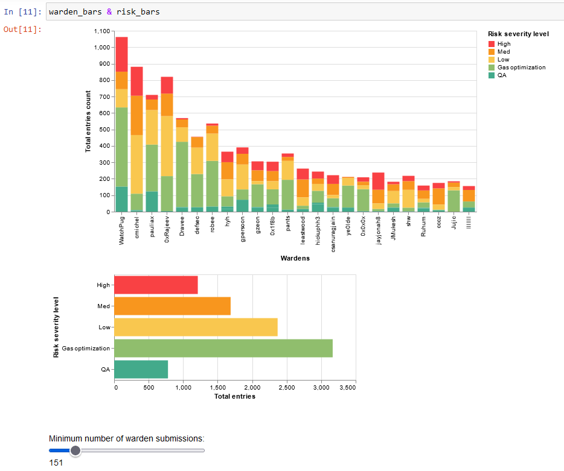

# code4rena-scraper
Scraping [Code4rena](https://www.code4rena.com) contest audits reports for stats, fun (and profit ?).

For accurate prize money numbers check the Code4rena [leaderboard](https://code4rena.com/leaderboard) directly.

## Why ?

To play around with the [Github API](https://docs.github.com/en/rest) and work my python scripting skills. It also got me working on data analysis tools like [Jupyter notebooks](https://jupyter.org/), [Pandas](https://pandas.pydata.org/docs/index.html) for manipulating the data and the [Altair](https://altair-viz.github.io/index.html) visualization framework.

At first, I was curious since I found out that the audits reports repos contains the address of each participant for sending their prize money (see [here](https://github.com/code-423n4/2021-05-nftx-findings/tree/main/data) for example, in the .json files). It could be an issue if certain people wants to stay anonymous on this platform.

Also, I realized after a week of working on this project that the [website repo](https://github.com/code-423n4/code423n4.com/tree/main/_data) of Code4rena already contains data for contests, findings and handles but hey, I learned a lot !

## What ?

Data is scraped from the [Code4rena](https://www.code4rena.com) published audits repos using the [Github API](https://docs.github.com/en/rest), as well as directly from the [leaderboard](https://code4rena.com/leaderboard) and [contests](https://code4rena.com/contests/) entries of the Code4rena website and is parsed to CSV files.

***This part hasn't been implemented or explored too much yet***

Part of the data extracted can be used to link ETH/Polygon addresses to contest participants. Using tools like [polygonscan](https://polygonscan.com), [etherscan](https://etherscan.io) or [Bitquery](https://explorer.bitquery.io/) allows to look at the flow of funds from and to those wallets.

Is it useful ? Probably not.

Worth the time ? I'd say yes as it gave me insights as to how to track funds accross different chains (Polygon, Ethereum mainnet, etc.).

*----------------------------------------------------------------------------*

Also, the extracted data allows to see who might be most efficient, writes the most duplicates, percentage of invalid submission, etc. Jupyter notebooks can be found in the [charts_data](charts_data/) folder to visualize the data (requires [altair-viz](https://altair-viz.github.io/getting_started/installation.html)).

What's been implemented so far:

- Timeline of wardens participations and bar chart of the number of new participants grouped by their first contest date – *pro tip: drag the mouse on the right bar chart to filter for starting dates in the timeline chart*.


[Try it here !](https://nbviewer.org/github/Krow10/code4rena-github-scraper/blob/master/charts_data/participants_longevity.ipynb)
- Stacked bar chart which shows the growth of the number of wardens as well as the active (includes brand new wardens), non-participating and inactive proportions of wardens for each month.


[Try it here !](https://nbviewer.org/github/Krow10/code4rena-github-scraper/blob/master/charts_data/participants_growth.ipynb)
- Stacked bar chart showing the number of entries submitted by each warden, grouped by severity. Also show the total number of submissions for each severity category – *pro-tip: left click (or shift + left click) for filtering the data by one or more severity level*.


<br/>[Try it here !](https://nbviewer.org/github/Krow10/code4rena-github-scraper/blob/master/charts_data/participants_by_report_severity.ipynb)
- Multi-line plot of the correlation between the number of reports and the prize money of a warden for each report category – *pro-tip: change the evaluated period with the dropdown below the chart*.


[Try it here !](https://nbviewer.org/github/Krow10/code4rena-github-scraper/blob/master/charts_data/severity_revenue.ipynb)
- Boxplot of the prize money distribution per prize pool with customizable bucket size for the prize pool data.


[Try it here !](https://nbviewer.org/github/Krow10/code4rena-github-scraper/blob/master/charts_data/contests_prize_pool_distribution.ipynb#Prize-money-distribution-per-prize-pool-(boxplot))
- Horizontal bar chart of the top n<sup>th</sup> warden's share of the prize pool, for each prize pool value. This data shows how much of the total prize pool the first (or second, third, ... customizable) warden capture for him/herself, with the mean value indicated as a purple vertical line – *pro-tip: click on the legend to highlight a particular warden (or shift+left click for multiple).*


[Try it here !](https://nbviewer.org/github/Krow10/code4rena-github-scraper/blob/master/charts_data/contests_prize_pool_distribution.ipynb#Top-warden's-share-per-prize-pool)

## How ?

Use [`main.py [leaderboard|contests|github|all]`](main.py) to fetch and parse the latest data in CSV files.

Currently, the extracted data from the Github API ([github_code4rena.csv](github_code4rena.csv)) looks like this:
| contest_id | handle | address | risk | title | issueId | issueUrl | contest_sponsor | date | tags |
| ---------- | ------ | ------- | ---- | ----- | ------- | -------- | --------------- | ---- | ---- |
| Identifiy the contest | Name of the warden | Polygon address | Caracterize the submission criticity (0 to 3, G for gas optimization, Q for QA) | Title of the submission | Github issue number | Github issue URL (unused) | Contest sponsor extracted from repo's name | Contest running date extracted from repo's name | Tags associated with issue (further caracterize the submission) |

So each line in the csv file corresponds to one submission (identified by the `issueId`) of a warden (identified by his/her `(handle, address)` pair) for a given contest (identified by the `contest_id`).

The data can then be imported inside a Jupyter notebook (or anywhere else, how you want to parse it) for easy processing and visualization like so:
```python
import pandas as pd
import altair as alt

alt.data_transformers.disable_max_rows() # Disable 5_000 rows limit
data = pd.read_csv("../github_code4rena.csv") # Set path accordingly
```

For the leaderboard ([leaderboard_code4rena.csv](leaderboard_code4rena.csv)), the data looks like this:
| period | handle | is_team | prize_money | total_reports | high_all | high_solo | med_all | med_solo | gas_all
| ------ | ------ | ------- | ----------- | ------------- | -------- | --------- | ------- | -------- | -------
| The period for which the data comes from | Name of the warden | Boolean indicating if the handle refers to a team or not | Total earnings for the period (in $USD) | Total accepted reports for the period | High severity issues found with others | High severity issues found alone | Medium severity issues found with others | Medium severity issues found alone | Gas optimization reports submitted

And for the contests ([contests_code4rena.csv](contests_cod4rena.csv)), the data looks like this:
| contest_report_repo | contest_sponsor | contest_desc | start | end | prize_pool | handle | prize_money | total_reports | high_all | high_solo | med_all | med_solo | gas_all
| - | - | - | - | - | - | - | - | - | - | - | - | - | -
| The name of the Github repo for the contest audit report or empty if not published yet | Name of the contest sponsor (lowercase, stripped) | Description of the contest sponsor | Starting date of the contest | Ending date of the contest | Total prize pool (calculated from the sum of warden's prize money) | Name of the warden | Total earnings for the contest (in $USD) | Total accepted reports for the contest | High severity issues found with others | High severity issues found alone | Medium severity issues found with others | Medium severity issues found alone | Gas optimization reports submitted

## Next ?

- [x] Get linked audits issues tags and add the data to the csv (helps flag invalid, duplicate and accepted submissions)
- [x] Use data analysis modules or external programs to actually do something with the data
- [X] For each contest, scrape the prize pool and results from the Code4rena contest page ([example](https://code4rena.com/contests/2021-02-slingshot-finance-contest)) and make a [ridgeline plot](https://altair-viz.github.io/gallery/ridgeline_plot.html) showing the distribution of rewards for each prize pool amount (with layered distribution for same pool amount) or simpler [boxplots](https://altair-viz.github.io/gallery/boxplot.html)
- [ ] Try to make [ridgeline](https://altair-viz.github.io/gallery/ridgeline_plot.html) work (it looks so sick!)
- [ ] Rework Github scraping for returning DataFrame for consistency
- [ ] Rework scraping of issue labels to identify first labels (meaning original submission severity level) and last labels or maybe track entire history of labels in chronological order
- [ ] Valid / invalid reports charts by contest sorted by start date (bars again ?)
- [ ] Connect to Polygon/Ethereum blockchain to show the balances of the addresses listed
- [ ] Add command line argument parsing
- [ ] Make CSV files update rather than recreate all data ? 
- [x] ~~Some more data mining from on-chain data maybe (GraphQL API would be best)~~ *won't do, no time*
